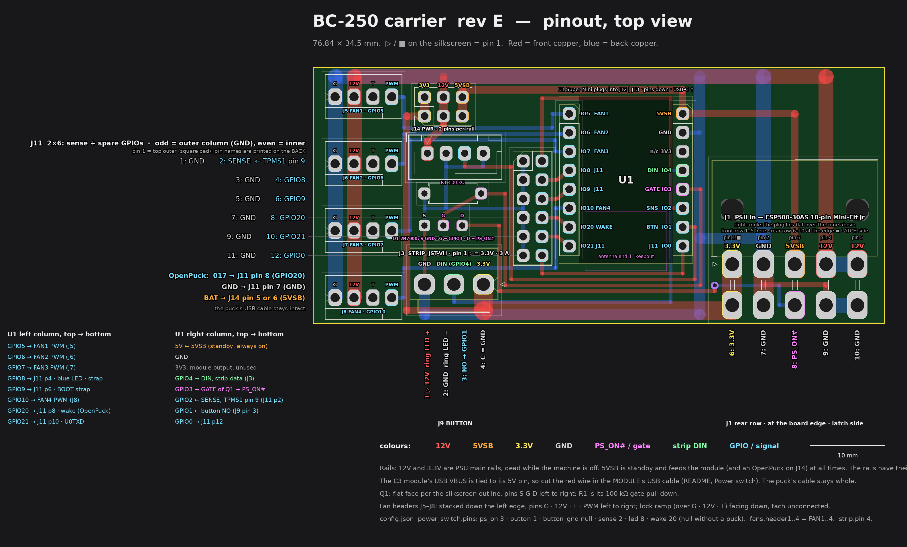

# BC-250 carrier board (rev E)

Rev E is the same carrier as [rev D](../bc250_carrier/README.md), with the same
parts, nets and firmware, laid out differently: **every plug sits on the left,
the PSU header at the board's right-hand end, and the module directly beside
it.** The fans run down the left edge, the breakouts, the button and the strip
sit in a column beside them, and no signal has to cross the PSU plug's zone.
76.8 × 34.5 mm (rev D: 80 × 34.5), two layers.

*`make pinout` → `pinout.png`, drawn from `generate.py`'s geometry. Open it
at full size for soldering.*

Both revisions stay buildable side by side: rev D in `hardware/bc250_carrier/`,
rev E here. The tools (`check.py`, `drc.py`, `fill.py`, `preview.py`,
`fab.py`, `zoom.py`) are copies of rev D's and work the same way; only
`generate.py` and `pinout.py` differ.

## Layout

Left to right:

- **The four fan headers** stacked down the left edge, 9 mm apart, pins
  G · 12V · T · PWM left to right, lock ramps facing down. Their 12 V and GND
  are two bars down the column.
- **Column C**, top to bottom: the power breakout **J14**, the button **J9**,
  **R1**, **Q1** and the strip **VH (J3)**. The fan PWM lines cross it in
  three lanes between J14 and J9 (FAN4's between Q1 and the VH).
- **J11** (the sense wire and the spare GPIOs), right beside the module's
  left pad column.
- **The Super Mini** in its two sockets (J12, J13), USB-C at the top edge.
  Nothing sits under it, so it can still be soldered flat instead of
  socketed.
- **The PSU header (J1)** directly beside the module at the right-hand end,
  the same right-angle Mini-Fit Jr as rev D, facing the same way: the plug
  lies flat over the board's right quarter and its wires leave over the top
  edge. Everything above the header is the **plug zone**: tracks only,
  nothing taller than the solder mask.

The module's right pads (DIN, GATE, BTN, GPIO0) face the PSU header, so their
lines go round the module: down the gap between it and the header (6.7 mm between their pin columns) (or
inside its right pad column) and west along the bottom edge under its antenna
end, next to the strip's 3 A feed from the header's 3.3V pin.

No mounting holes: the plug zone has to stay flat and every other spot is
taken. The repo's case isn't used with this board.

## What is on it

The same parts as rev D (see its ordering table; J11 and J14 are still cut
from 2 × 8 pin headers and left off assembly orders).

The rev C fan headers (Ckmtw W-2510S04P, KF2510) fit the same holes, but
only just: their body is 12.7 mm long (the Molex's about 10.2), so FAN2's
reaches about 0.2 mm into J9's housing and FAN3's and FAN4's about 0.15 mm
into J3's. Dry-fit first: fit J9 and J3, then push each fan header towards
the left edge while soldering it (the pins have about 0.15 mm of play in
their holes); if one still won't sit flat, file about 0.3 mm off the end
facing column C. Their lock ramp spans all four pins, so it needs cutting
down as on rev C; fit them with the ramp facing down the board, as the
silkscreen shows. A fan plug as long as 12.7 mm would just touch J9 or J3
when plugged in (not checked on a real plug).

| ref | part | where |
|---|---|---|
| J5–J8 | four Molex 47053-1000 fan headers, stacked, pins G 12V T PWM left to right | left edge |
| J14 | 2 × 3 power breakout, turned: three columns 3V3, 12V, 5VSB, two pins each | column C, top |
| J9 | JST-XH 4-pin button connector: pins 12V, GND, NO, C left to right | column C |
| R1, Q1 | 100 kΩ; 2N7000 on the wide TO-92 footprint (S G D left to right) | column C |
| J3 | JST-VH strip connector, turned 180: GND, DIN, 3.3V left to right | column C, bottom |
| J11 | 2 × 6: SENSE + five spare GPIOs, GND beside each (as rev D) | between column C and the module |
| U1 on J12 + J13 | ESP32-C3 Super Mini in two 1 × 8 low-profile sockets | beside the PSU header |
| J1 | PSU header, Mini-Fit Jr 5569-10A2 right-angle | right-hand end |

## Wiring

| connector | pins | goes to |
|---|---|---|
| PSU J1 | as rev D ([the PSU header](../bc250_carrier/README.md#the-psu-header)) | the FSP500-30AS 10-pin plug, straight on |
| STRIP J3 | 1 `3.3V`, 2 `DIN`, 3 `GND`; pin 1 is the **right** pin | the WS2812B strip; DIN is GPIO4 |
| BUTTON J9 | 1 `12V`, 2 `GND`, 3 `NO`, 4 `C`; pin 1 is the **left** pin | the illuminated button as on rev D: 1–2 the ring LED (12 V), 3 the normally-open contact → GPIO1, 4 the switch's common (a real GND) |
| J11 | 1 `GND` / 2 `SENSE`, 3 / 4 `GPIO8`, 5 / 6 `GPIO9`, 7 / 8 `GPIO20`, 9 / 10 `GPIO21`, 11 / 12 `GPIO0` (odd pins GND) | as rev D: the sense wire (BC-250 TPMS1 pin 9) on pin 2; OpenPuck `017` → pin 8, its GND → pin 7 |
| J14 | columns left to right: pins 1+2 `3.3V`, 3+4 `12V`, 5+6 `5VSB` | optional rail breakout; an OpenPuck's BAT goes on 5VSB (pin 5 or 6) |
| FAN1 J5 … FAN4 J8 | left to right: `G`, `12V`, `T`, `PWM` | standard 4-pin fans, tach unconnected; FAN1..4 = GPIO 5, 6, 7, 10 = `header1..4` in the config, top to bottom. The lock ramps face down the board |

The config is unchanged from rev D: the same `power_switch` pins, the same
fan headers, `strip.pin` 4.

## Routing

The rule from rev D holds: on the back, where every joint is soldered, **12 V
passes no pad of 5VSB, GATE, 3.3V, PS_ON# or any GPIO within 1 mm.** The
only 12 V on the back is the PSU header's own pin 4-5 tie (J14's pins sit
0.84 mm apart at the 2.54 mm pitch, as on any header). A slipped bridge on the
back can short a rail to ground or switch the PSU, never feed 12 V into the
module. On the front, under FAN1's plastic, the top-edge 12 V passes FAN1's
PWM pin at 0.6 mm.

- **12 V** leaves the PSU header's pin 4 straight up through the plug zone
  and runs along the top edge on the front (2 mm, ~3.5 A), then down the
  fans' 12V pins as a bar. J14's 12 V column taps it, and J9's LED is fed
  from that column on the front.
- **The fans' ground** runs along the top edge on the back, right under the
  12 V, and down the fans' G pins, so the fan current's loop is one narrow
  strip. At the other end it drops into the PSU header's pin 2. A **ground
  spine** runs down the back of the gap between the module and the header,
  from the top edge to the bottom edge; the module's GND pad joins it, a
  branch goes over pin 1 into pin 2, and the strip's 3 A return comes east
  along the bottom edge from the VH's GND pin into it. J9's, J11's, Q1's and
  R1's grounds have a web of their own down column C into the VH's GND pin,
  and the ground fill on both layers, stitched with ground vias, ties in
  everything else.
- **3.3V** (3 A) leaves the header's pin 6 as a 2.5 mm track west along the
  bottom edge on the front, into the VH's pin 1. On from there, narrower, it
  runs under the VH's other pins to the gap by the fans and up it into J14's
  3V3 column.
- **5VSB** runs from the header's pin 3 up through the plug zone into the
  module's 5V pin (front), and on over the module's top to J14's 5VSB column.
- **The fan PWM lines** run west on the back: FAN1's to FAN3's off the
  module's top three pads, in three lanes under J14 to the gap by the fans,
  then up or down into each pin 4. FAN4's goes down between J11 and the
  module, under J11 and over the VH's pins.
- **DIN** goes down the back inside the module's right pad column (0.5 mm
  from the pads, clear of the antenna zone), west along the bottom and up
  into the VH's pin 2. **SENSE** goes up the same lane on the front and over
  the module's top into J11. **GPIO0** drops off its pad and goes west under
  the module's end into J11's bottom row.
- **BTN** and **GATE** go east off their pads, down the gap by the header,
  west along the bottom edge and up between column C and J11: BTN under J9
  into its pin 3, GATE into R1's pin 1 and on to Q1's gate. **PS_ON#** leaves
  the PSU header's pin 8 through the gap between its pin rows on the back,
  changes to the front through a via just past the header's left end and
  follows them into Q1's drain.

Clearances as rev D: 0.5 mm from any solder pad to copper of another net,
0.3 mm track to track, 0.5 mm fill clearance; `check.py` and KiCad's DRC are
both clean.

## Building, checking, ordering

As rev D: [building it](../bc250_carrier/README.md#building-it),
[before the first power-up](../bc250_carrier/README.md#before-the-first-power-up)
(the PSU header's pins are numbered the same; on rev E Q1's middle hole is
still the gate), [ordering](../bc250_carrier/README.md#ordering) (`make`
writes `out/fab/` here too) and [flashing](../bc250_carrier/README.md#flashing-for-this-board).
Q1's legs are printed S G D on rev E (left to right), the opposite way round
from rev D's D G S: follow the silkscreen outline.

`make` regenerates the KiCad files (`bc250_carrier_e.*`), fills and stitches
the ground, runs `check.py` and KiCad's DRC, renders `out/preview.png` (plus
`preview-F.png` / `preview-B.png`, one layer each) and `pinout.png`, and
exports gerbers, PDFs and the fab folders into `out/`.
